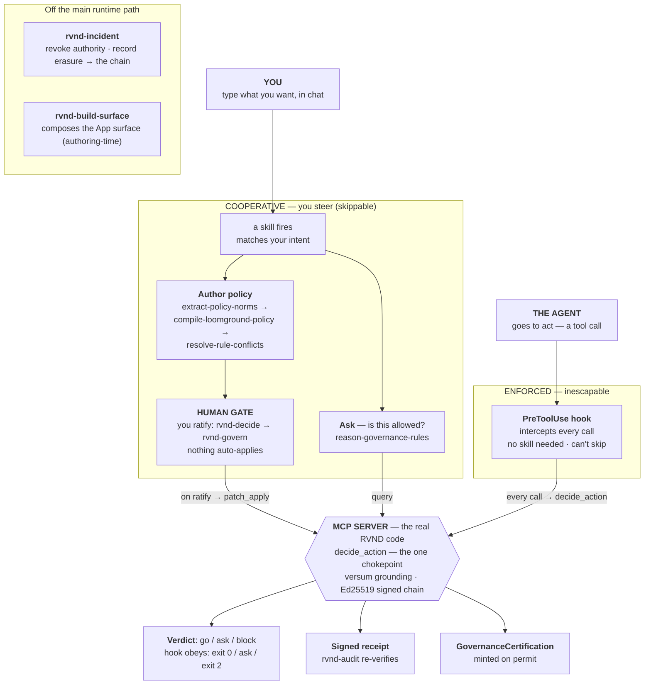

# How RVND governs an agent

RVND turns "governance" from advice into something **provable and enforced**. When
you drive it in chat, two things are true at once:

- **Skills are the steering wheel** — how you shape governance by typing. They are
  cooperative and *skippable*.
- **The PreToolUse hook is the seatbelt** — it gates every tool call whether or not
  you invoke a skill. It *cannot* be skipped.

Both drive the **same engine** (`decide_action`), and nothing becomes policy until
a human ratifies it.

## The flow



The *cooperative* lane (skills) is how you express governance by typing; the
*enforced* lane (the hook) is what governs the agent even when you never invoke a
skill. They are different entry points that meet at one place — `decide_action`,
the same chokepoint the rest of RVND uses. A human appears twice: as the
**ratifier** when policy is applied, and as the approver whenever a verdict comes
back **ask**.

### The nine skills, by role

- **Ask** (runtime query) — `reason-governance-rules`, `rvnd-govern`
- **Author** (rules from policy) — `extract-policy-norms`, `compile-loomground-policy`, `resolve-rule-conflicts`
- **Decide** (human) — `rvnd-decide`, `rvnd-govern`
- **After** (verify & respond) — `rvnd-audit`, `rvnd-incident`
- **Compose** (build the surface) — `rvnd-build-surface`

## Two guarantees

**Grounding — you can audit it.** Every step returns a checkable artifact: a
`versum` span (a citation back to your source), a typed Loomground envelope, a
validated projection, and a signed chain receipt. A skill cannot fake a verdict —
the receipt is signed by the server, not the agent. `rvnd-audit` re-verifies any
receipt against the per-folder Ed25519 hash chain.

**Enforcement — you needn't ask.** Skills are how you *express* governance. The
**PreToolUse hook** is what governs the agent's actions even when you never invoke
a skill. `exit 2` is the one exit Claude Code always honours; the hook fails closed.

## Verify enforcement

The hook reads a PreToolUse event on stdin and exits **2 = blocked**, **0 =
allowed** (an "ask" is exit 0 with a permission prompt). You can confirm both that
it is installed and that it enforces — no agent required.

**Is it installed?**

<!-- doctest: skip -->
```bash
rvnd-hook --status
# installed (user): ~/.claude/settings.json
# mode=enforce  command=… -m workspaces.hook
```

Install it with `rvnd-hook --install` (or `./scripts/connect-agent-hub.sh`, which
also registers the MCP server and the governance skills).

**Does it enforce?** Pipe an event to the hook — it only *decides*, it never runs
the command:

<!-- doctest: skip -->
```bash
# a NO-GO action → exit 2 (blocked)
echo '{"tool_name":"Bash","tool_input":{"command":"rm -rf /"}}' | rvnd-hook; echo "exit=$?"

# a benign action → exit 0 (allowed)
echo '{"tool_name":"Read","tool_input":{"file_path":"README.md"}}' | rvnd-hook; echo "exit=$?"
```

A block prints an actionable reason, for example:

```
[rvnd] blocked by governance: grade L2 below required for 'irreversible'
(needs grade ≥ 3 under balanced posture). to proceed: raise the autonomy
grade (RVND_AUTONOMY_GRADE), add a standing approval for this action class,
or run it yourself
```

**Dry-run before you enforce:** `RVND_HOOK_MODE=monitor` logs what *would* block
(to `RVND_HOOK_LOG_ROOT`) without blocking. Modes are `enforce` (default),
`monitor`, and `off`.

> In a source checkout, use `python -m workspaces.hook` in place of `rvnd-hook`.

## Where this lives in the repo

| Piece | Path |
|---|---|
| MCP server | `python -m workspaces.mcp_server` (the `rvnd-governance` server) |
| Skills | `plugin/rvnd-governance/skills/` |
| Enforcement hook | `server/src/rvnd/hook.py` (`rvnd-hook`) |
| Installer | `scripts/connect-agent-hub.sh` registers all three |
