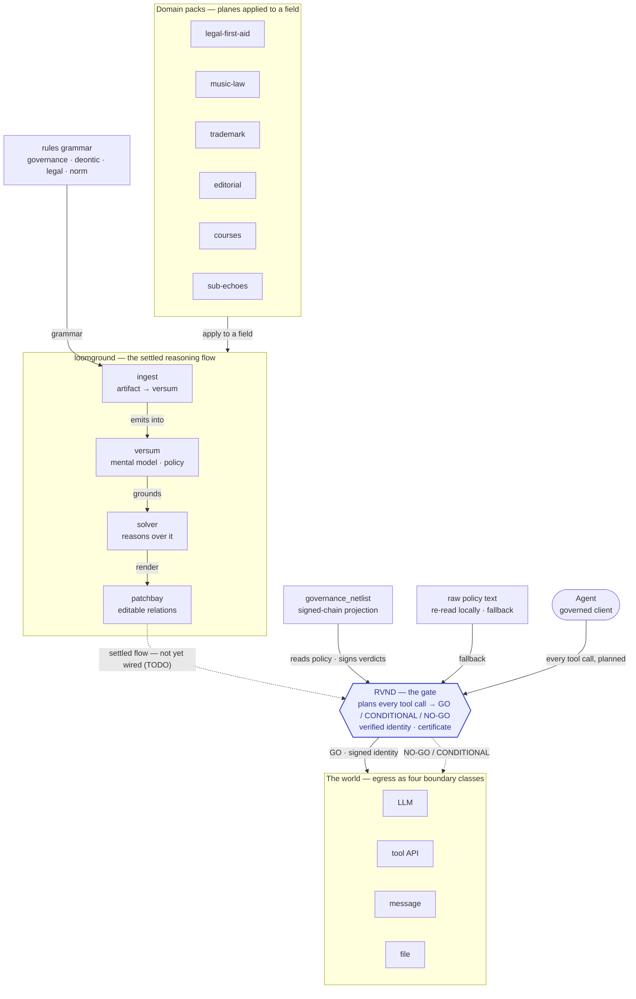

# Planes and the gate — the loomground × RVND surface

loomground gives you one composable **reasoning flow**. **RVND is the gate every agent
world-touch funnels through**. The settled flow is `ingest → versum → solver → patchbay → rvnd`
— but the last hop is not wired yet, so this map draws **live** edges solid and the **settled-but-
pending** edge dashed. For the request→enforcement walk-through see
[`governance-flow.md`](governance-flow.md).

## Settled flow vs. what runs today

The spine `ingest → versum → solver → patchbay` is the **settled flow** — the code names it
verbatim in [`deontic_facets.py`](../../server/src/workspaces/deontic_facets.py):
*"per the settled flow `versum → solver → patchbay → rvnd`, the deontic nD facet is emitted by
ingest into versum and should reach RVND as an editable **patchbay relation**."*

But the final hop **`patchbay → rvnd` is not wired yet** — an open `TODO(flow)` in
`deontic_facets.py`, `memo.py`, and `requirements_house.py`: *"until that patchbay→rvnd path
exists, the `*_from_text` builders re-run the surface reader locally … a deliberate, bounded
fallback."* Until it lands, the skills reach the gate two other ways, both drawn **solid**:

- **`governance_netlist`** — *"a read-only graph assembled from the signed chain"*
  ([`governance_graph.py`](../../server/src/workspaces/governance_graph.py)); what
  `compile-loomground-policy` and `reason-governance-rules` (`operate`) read.
- **raw-text fallback** — the deontic facet re-read locally, bypassing the spine.

The dashed edge marks the hop that will unify them.

## What each node is

| Group | Node | Role |
|---|---|---|
| Flow | `ingest` | turn a manual, policy, or tool surface into a dimensioned subgraph, emitted into versum |
| Flow | `versum` | the mental model it writes into; the policy lives here |
| Flow | `solver` | reasons over the model: risk, liability, litigation-risk, strategy |
| Flow | `patchbay` | the editable relations / boundary view (render stops here today) |
| Grammar | `governance · deontic · legal · norm` | the rules vocabulary ingest dimensions with |
| Live path | `governance_netlist` | signed-chain projection the gate reads today |
| Gate | **RVND** | plans, rates `GO`/`CONDITIONAL`/`NO-GO`, verifies identity, mints the certificate |

## The through-line

loomground gives you one composable reasoning flow; RVND makes any agent using it **accountable**.
Skills are how work gets *requested*; RVND is how it gets *permitted*. The map is only useful if it
tells the truth about built-vs-planned — hence the dashed hop. Everything but the **oversight
certificate** and the **patchbay boundary view** deliberately composes on existing FOSS.
